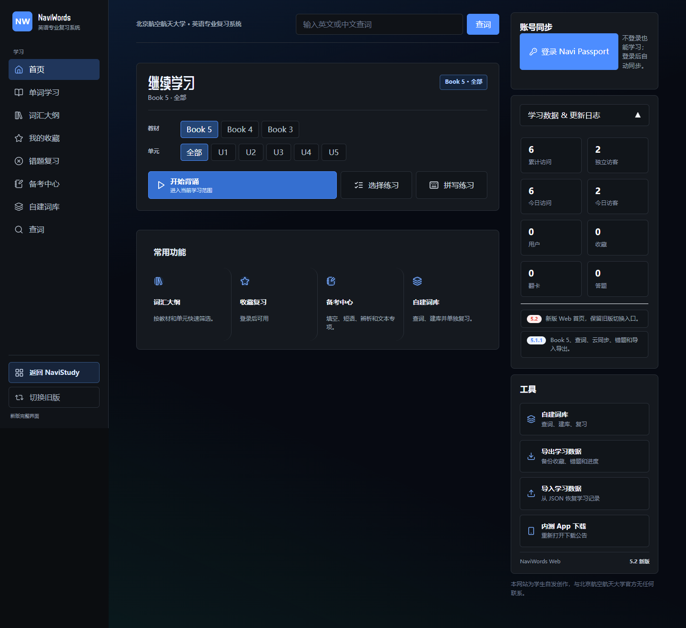
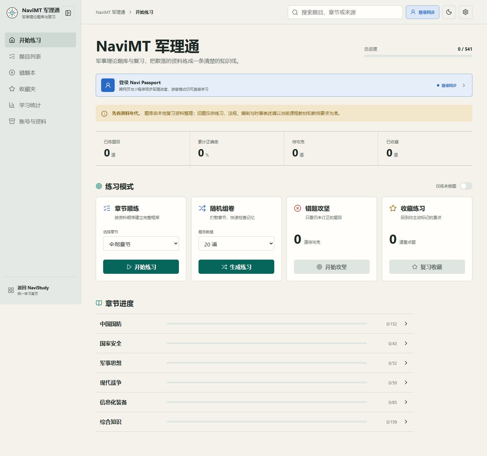

  <h1>黄纬鑫 / Weixin Huang</h1>
  
<strong>Language, systems, and communities.</strong> 北航英语专业学生 · 游戏内容与系统设计 · 教育工具与校园出版

  

    <a href="https://www.dxir.net.cn/">个人网站</a> ·
    <a href="https://cv.dxir.net.cn/">CV</a> ·
    <a href="mailto:dxir@buaa.edu.cn">Email</a> ·
    <a href="https://space.bilibili.com/424119061">Bilibili</a>
  

  

我喜欢把复杂的规则写成清楚的文案，把零散的想法组织成可以协作的项目，也愿意为一小部分真实的人专门做课程、刊物或产品。

我在北京航空航天大学学习英语，也持续参与游戏设计与内容运营、校园出版、中学生科普实践和实用工具开发。语言和技术对我而言并不冲突：它们都在帮助一件事被理解，并最终被人使用。

> I work where language meets systems: turning complicated rules, shared interests and real communities into things people can understand, use and keep building together.

## 主推项目 / Featured project

<table>
  <tr>
    <td width="58%" valign="top">
      <h3>NaviStudy</h3>
      
<strong>一套面向真实学习场景的本地优先学习平台。</strong>

      
我把两套原本独立的学习工具重新组织为一个平台：使用同一个 Navi Passport，学习数据仍按产品隔离。这样，账号体验可以统一，Words 与 MT 的学习模型、内容边界和同步权限也不会互相污染。

      

        <a href="https://github.com/Spelight/navistudy">查看源代码</a> ·
        <a href="https://study.dxir.net.cn/">访问 NaviStudy</a>
      

      
<code>local-first</code> <code>Passport</code> <code>sync</code> <code>Web</code> <code>WeChat</code>

    </td>
    <td width="42%" valign="top">
      
    </td>
  </tr>
</table>

### 一个入口，两套独立的学习体验

<table>
  <tr>
    <td width="50%" valign="top">
      
      
<strong>NaviWords</strong> 英语词汇复习与练习，面向教材、单元和个人复习节奏。

    </td>
    <td width="50%" valign="top">
      
      
<strong>NaviMT 军理通</strong> 把零散的军理资料整理成清晰的章节、题目与复习路径。

    </td>
  </tr>
</table>

| 平台判断 | 实现方式 |
| --- | --- |
| 账号体验统一 | Navi Passport 负责身份、会话和设备管理 |
| 学习数据不混 | Words 与 MT 使用独立数据空间和授权范围 |
| 先能学习再同步 | 游客模式保留，本地记录可在登录后合并 |
| 内容不误公开 | 公开仓库只放应用代码、协议、测试和 synthetic fixtures |

这也是我希望持续练习的事情：把一个“能跑的工具”推进成有边界、有恢复能力、有人愿意长期使用的产品。

## 我在做什么 / Now

- 在 **Esh Group** 参与游戏设计、品牌内容与媒体运营
- 负责 **北航招生协会新媒体工作**，参与学校整体招生与在琼招生工作
- 维护面向初学者的编程练习支持，继续推进 **Navi OJ**
- 参与 **航行星琼**，把航空航天、编程和项目式学习带进海南中学课堂
- 继续做校园出版、游戏本地化，以及那些值得被认真做好的小工具

## 代表性工作 / Selected work

### 把大学课堂带回海南

我担任 **航行星琼实践队队长、办公室成员**。团队在北航海南招生组指导下，组织大学生返乡，为海南中学生设计航空航天、编程和项目式学习课程。

<a href="https://www.dxir.net.cn/projects/navi-stars/">项目故事</a> · <a href="https://navi-stars.dxir.net.cn/">实践队网站</a>

### 游戏是我学习系统设计的第一间教室

<table>
  <tr>
    <td width="50%" valign="top">
      
      
<strong>EaseCation</strong> 参与游戏设计、品牌内容与媒体运营，长期思考如何把复杂玩法变成玩家愿意理解、参与和记住的体验。

    </td>
    <td width="50%" valign="top">
      
      
<strong>海风物语</strong> 从一次同学联机开始，和伙伴建立由学生社团运营的公益 Minecraft 社区。

    </td>
  </tr>
</table>

<a href="https://www.dxir.net.cn/projects/easecation/">EaseCation</a> · <a href="https://seawindtales.top/">海风物语</a> · <a href="https://www.dxir.net.cn/projects/localization/">游戏本地化与插件协作</a>

### 让校园文字拥有正式的去处

我于 2024 年创立 **海南中学（美伦校区）校刊编辑部**，并继续担任顾问，把征稿、审读、排版、印刷和修订组织成持续工作的出版流程。

<a href="https://www.dxir.net.cn/projects/literature/">项目故事</a> · <a href="https://literature.dxir.net.cn/">校刊网站</a> · <a href="https://github.com/Spelight/literature-submission-site">开源投稿系统</a>

## 我也把麻烦做成工具

- **[BatteryAutoProfileApp](https://github.com/Spelight/BatteryAutoProfileApp)** · `C#` `WinForms` `Windows APIs`：让 Windows 笔记本在离电时自动省电、接电后可靠恢复性能。
- **[tabby-notepadpp-sftp-edit](https://github.com/Spelight/tabby-notepadpp-sftp-edit)** · `TypeScript` `SFTP`：在 Tabby 中用 Notepad++ 编辑远程文件，保存后自动上传。
- **[lol-match-review](https://github.com/Spelight/lol-match-review)** · `JavaScript` `LCU/SGP`：在本地采集、整理和复盘英雄联盟对局，保留隐私边界和证据链。
- **[literature-submission-site](https://github.com/Spelight/literature-submission-site)** · `Python` `SQLite` `Nginx`：为校园刊物提供轻量、可部署、可审阅的招新与投稿工作流。

这些项目通常从一个具体问题开始：重复操作太多、规则太难解释、数据散落各处，或者现成工具没有照顾真正使用它的人。我会把它们整理成可运行的程序、清楚的 README、安全默认值和可恢复的工作流。

## 继续往前 / Keep building

我不太在意把自己包装成“什么都会的人”。我更在意的是：遇到一个真实问题时，能不能把它讲清楚、做出来、交给别人使用，然后根据反馈继续修正。

完整的项目与文字记录在 **[www.dxir.net.cn](https://www.dxir.net.cn/)**。很高兴认识你。
