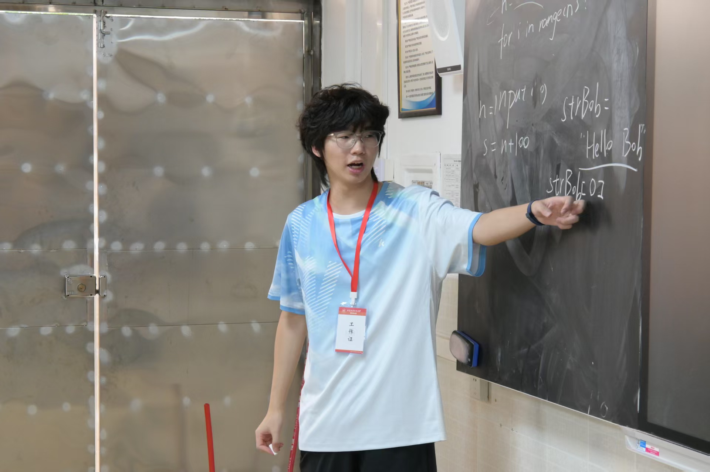
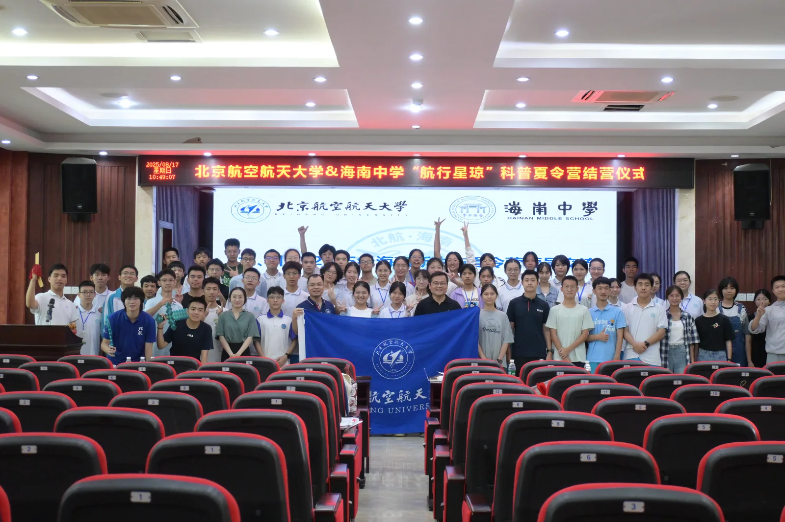
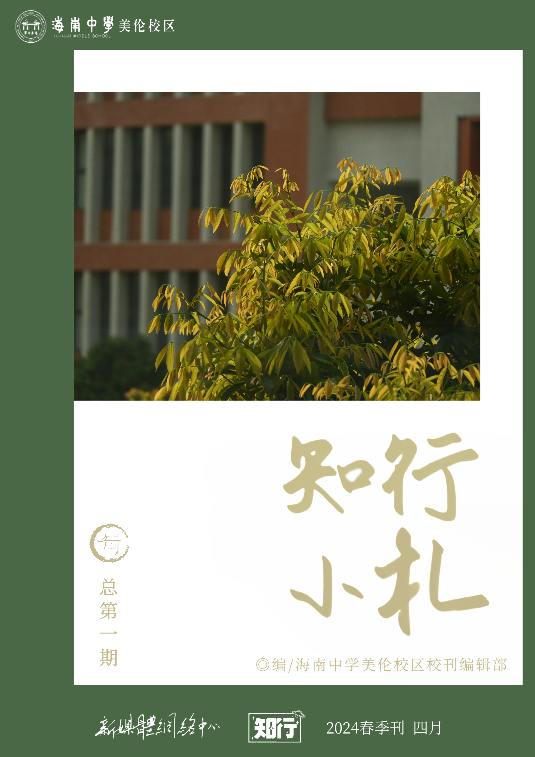

# 黄纬鑫 / Weixin Huang

**Dxir · English undergraduate at Beihang University · Beijing**

[个人网站](https://www.dxir.net.cn/) · [English profile](https://www.dxir.net.cn/en/) · [CV](https://cv.dxir.net.cn/) · [Email](mailto:dxir@buaa.edu.cn) · [Bilibili](https://space.bilibili.com/424119061)

我喜欢把复杂的规则写成清楚的文案，把零散的想法组织成可以协作的项目，也愿意为一小部分真实的人专门做课程、刊物或产品。

我在北航学习英语，也持续参与游戏设计与内容运营、校园出版、中学生科普实践和实用工具开发。语言和技术对我而言并不冲突，它们都在帮助一件事被理解，并最终被人使用。

> I work where language meets systems: turning complicated rules, shared interests and real communities into things people can understand, use and keep building together.

## 把大学课堂带回海南

我担任 **航行星琼实践队队长、办公室成员**。实践队在北航海南招生组指导下，组织大学生返乡，把航空航天、编程和项目式学习带进海南中学课堂。

2024 至 2026 年，团队在 **三所学校开展五期活动**，累计覆盖 **500+ 名学生**，课程平均评分 **4.76/5**，并获北京航空航天大学招生办公室 **“领航实践队”** 称号。

[项目故事](https://www.dxir.net.cn/projects/navi-stars/) · [实践队网站](https://navi-stars.dxir.net.cn/)

## 游戏，是我学习系统设计的第一间教室

  
  

在 **EaseCation**，我参与游戏设计、品牌内容与媒体运营，服务于总用户超 1 亿、日活约 8 万的 Minecraft 社区；直接对接 50+ 位创作者，累计独立产出 **80,000+ 字原创文案**。从玩法规则到周年栏目，我关心的是怎样把复杂系统转化为玩家愿意理解、参与和记住的体验。

在 **海风物语**，我担任服主、策划与技术负责人。从文学社同学的一次联机开始，我们建立了一个由学生社团运营的全公益 Minecraft 社区，累计连接 **400+ 名玩家**，玩家来自海南约 **70% 的中学**。

[EaseCation](https://www.dxir.net.cn/projects/easecation/) · [海风物语](https://seawindtales.top/) · [游戏本地化与插件协作](https://www.dxir.net.cn/projects/localization/)

## 让校园文字拥有正式的去处

我于 2024 年创立 **海南中学（美伦校区）校刊编辑部**，并继续担任顾问。编辑部把征稿、审读、排版、印刷和修订组织成持续工作的出版流程。

- 《知行小札》累计售出 **200+ 册**，现由知行文学社接续运营
- 英文校报 **Voice of Meilun** 已发行 **10+ 期**
- 校刊网站同时提供招新、投稿、账号记录和编辑批示流程

[项目故事](https://www.dxir.net.cn/projects/literature/) · [校刊网站](https://literature.dxir.net.cn/) · [开源投稿系统](https://github.com/Spelight/literature-submission-site)

 

## 我也把麻烦做成工具

| Project | Why it exists | Built with |
| --- | --- | --- |
| [BatteryAutoProfileApp](https://github.com/Spelight/BatteryAutoProfileApp) | 让 Windows 笔记本在离电时自动省电、接电后可靠恢复性能 | C# · WinForms · Windows APIs |
| [tabby-notepadpp-sftp-edit](https://github.com/Spelight/tabby-notepadpp-sftp-edit) | 在 Tabby 中用 Notepad++ 编辑远程文件，保存后自动上传 | TypeScript · SFTP |
| [lol-match-review](https://github.com/Spelight/lol-match-review) | 在本地采集、整理和复盘英雄联盟对局，保留隐私边界和证据链 | JavaScript · LCU/SGP · CSV/JSON |
| [literature-submission-site](https://github.com/Spelight/literature-submission-site) | 为校园刊物提供轻量、可部署、可审阅的招新与投稿工作流 | Python · SQLite · Nginx · systemd |

这些项目通常从一个我自己遇到的具体问题开始：重复操作太多、规则太难解释、数据散落各处，或者现成工具没有照顾真正使用它的人。我会把它们整理成可运行的程序、清楚的 README、安全默认值和可恢复的部署流程。

## 现在 / Now

- 在 **Esh Group** 参与游戏设计、品牌内容与媒体运营
- 负责 **北航招生协会新媒体工作**，参与学校整体招生与在琼招生工作
- 担任 **大学计算机基础课程助教**，维护面向初学者的编程练习支持
- 继续推进 **航行星琼、Navi OJ、校园出版与游戏本地化**
- 主修英语，也一直在学不会但很想学会的东西

我的完整项目与文字在 [www.dxir.net.cn](https://www.dxir.net.cn/)。很高兴认识你。
